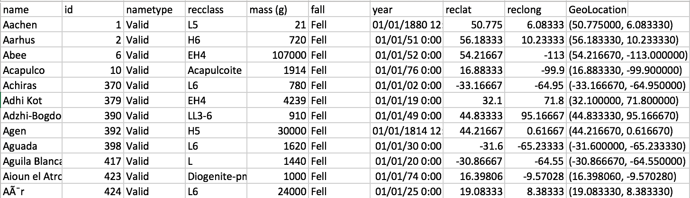
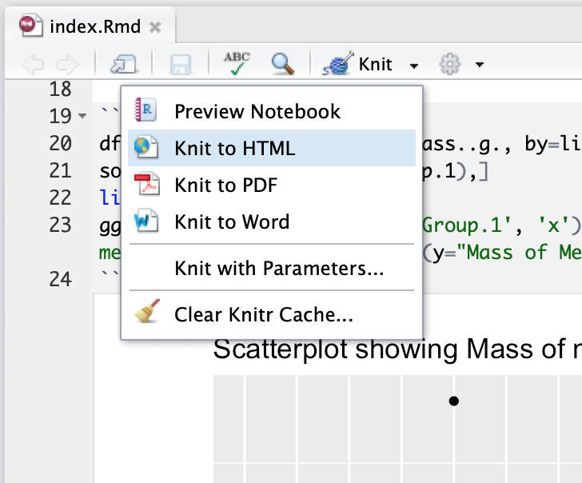
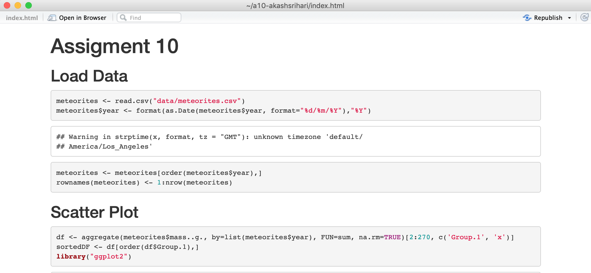

# INF 554 Assignment 10

## Table of Contents

* [Published Notebook Link](#published-notebook-link)
* [Data](#data)
* [Programming with R](#programming-with-r)
  * [Text Plot](#text-plot)
  * [Interactive charts with Plotly](#interactive-charts-with-plotly)
  * [Statenmap](#statenmap)
* [Publishing to RPubs](#publishing-to-rpubs)

## Published Notebook Link

The published notebook can be found [here](http://rpubs.com/akashsrihari/437356).

## Data

The source for this project is NASA's open source data for [Meteorite Landings](https://data.nasa.gov/Space-Science/Meteorite-Landings/gh4g-9sfh). Export data from the website as CSV to download it. Shown below is a screenshot of the first few rows of our dataset.



## Programming with R

The packages used for this assignment are ggplot2, plotly and ggmap. The rest of the work (data manipulation) was done with the default functions provided by R.

### Text Plot

The text plot can be made to look less cluttered by merging same labels that are overlapping. This can be done using the code snippet shown below.

```{r}
ggplot(plottingData, aes(plottingData$Group.1, plottingData$x)) + geom_text(aes(label = plottingData$Group.2), check_overlap = TRUE)
``` 

### Interactive charts with Plotly

The scatter plot created statically in the beginning was recreated with plotly to make it interactive (by providing a tooltip) and the code to do so is shown below.

```{r}
library(plotly)
ggplot(sortedDF[240:258, c('Group.1', 'x')], aes(Group.1, x)) + geom_point() + ggtitle("Scatterplot showing Mass of meteorites per year") + labs(y="Mass of Meteorites", x = "Year")
ggplotly()
```

### Statenmap

The map showing the state of California with a red dot plotted on it (representing my location at Troy East) was created with get_statenmap available in ggmap.

```{r}
bb <- c(left = -125.39, bottom = 31.0, right = -113.5, top = 42.0)
stamenmap.ca <- get_stamenmap(bbox = bb, zoom = 6, maptype = "toner")

my_house <- data.frame(label = "Troy East", lon=-118.2818, lat=34.0257)
ggmap(stamenmap.ca) + geom_point(data = my_house, aes(x=-118.2818, y=34.0257), color="red", size=2)
```

## Publishing to RPubs

The notebook was first converted to HTML using Knit in RStudio.



Once the HTML page was generated, using the publish button on the top right corner, the notebook was published to the RPubs account linked in the browser.

