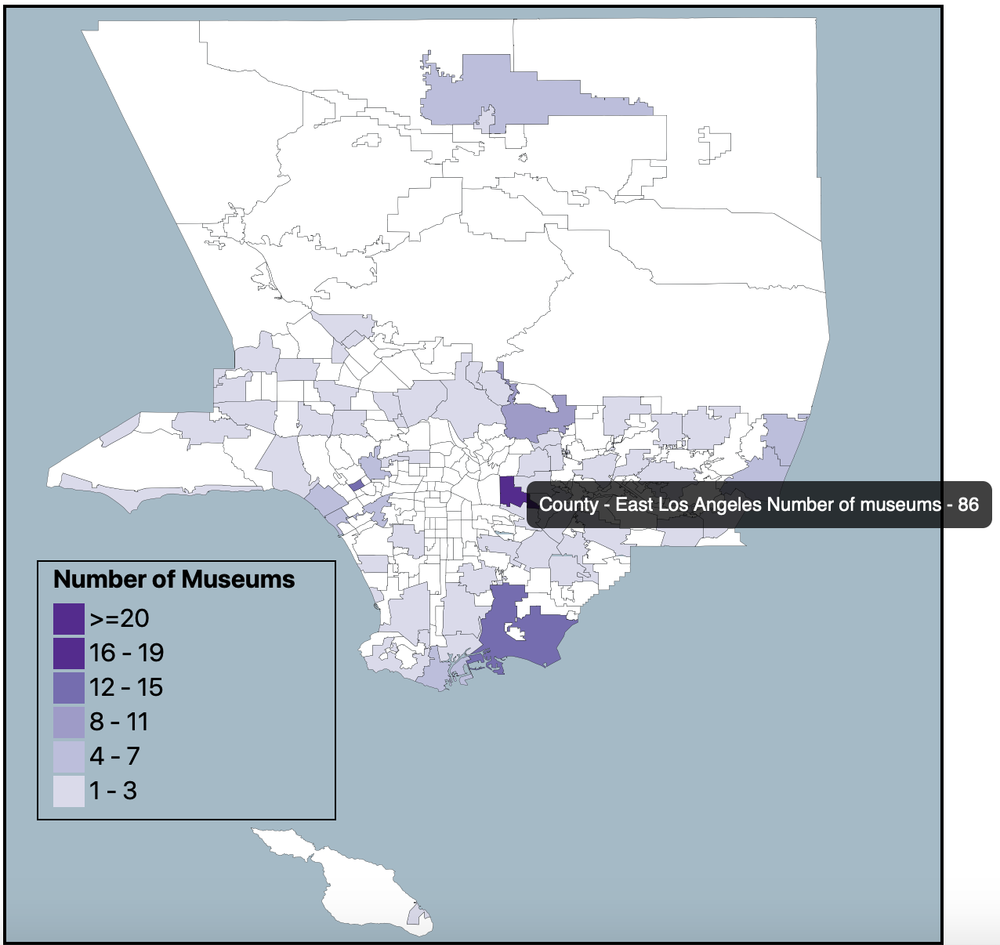

# INF 554 Assignment 9

## Table of Contents

* [Data Source](#data-source)
* [Building and Publishing a8](#building-and-publishing-a9)
* [USC SCF Published Webpage](#usc-scf-published-webpage)
* [Proportional Symbol Map and World Chloropleth](#proportional-symbol-map-and-world-chloropleth)
* [Los Angeles Country Chloropleth](#los-angeles-country-chloropleth)

## Data Source

The data source used for the assignment was the [UN database for GDP of countries](http://data.un.org/Data.aspx?q=GDP&d=SNAAMA&f=grID%3a101%3bcurrID%3aUSD%3bpcFlag%3a0) and the [County of Los Angeles Open Data](https://data.lacounty.gov/Arts-and-Culture/Map-LA-County-Museums/svhk-hgbg).

## Building and Publishing a9

The following command was used to build the angular project that was published onto aludra.

```bash
ng build --prod --output-path a9 --base-href src
```

This was because index.html that gets rendered exists in src. Once all files were generated, the folder was moved to public_html in aludra to be published using the command below.

```bash
scp -r ~/a9-akashsrihari-1/a9 chinam@aludra.usc.edu:~/public_html
```

## USC SCF Published Webpage
   
The published webpage on USC SCF can be found [here](http://www-scf.usc.edu/~chinam/a9).

## Proportional Symbol Map and World Chloropleth

The World Map for both the charts was created using an EquiRectangular projection and TopoJSON data. The GDP values for each country were included in the properties section of the TopoJSON file itself, making it easier to access them in the .ts file. Using the following snippet, the circles were added to the svg.

```typescript
const country = svg.append('g')
        .attr('class', 'boundary')
        .selectAll('boundary')
        .data(topojson.feature(world, world['objects'].countries).features)
        .enter();
country.append('circle')
        .attr('r', function(d) {
            return d['properties'].GDP;
        })
        .attr('cx', function(d) {
            return path.centroid(<any>d)[0];
      })
        .attr('cy', function(d) {
          return path.centroid(<any>d)[1];
        })
        .attr('fill-opacity', '0.3')
        .attr('stroke', 'black');
```

Similarly, the colors for each country in the chloropleth were added.

## Los Angeles Country Chloropleth

The LA county map was created using an equirectangular project also. Since the county has a lot of neighborhoods, the labels were not added to avoid overlapping and unclear labels. Instead of labels, a tooltip was added so that when the mouse is hovered over any of the neighborhoods, the name and number of museums in it are shown. 


