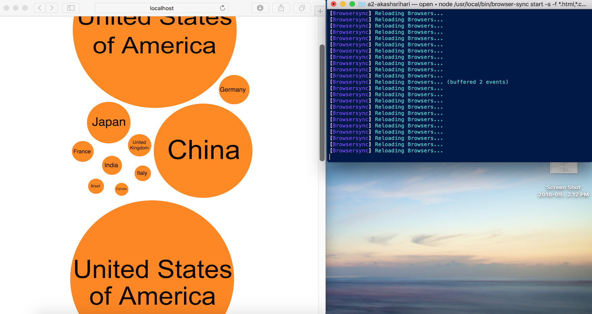

# INF 554 Assignment 2

## UN Data - Gross Domestic Product

The data used to create bubble charts in [index.html](index.html) was taken from the GDP data available [here](https://docs.google.com/spreadsheets/d/12j52HkDqWc8gR1CMKEu_HGeD7os6rUUxCGyS7XV18qQ/edit#gid=1264931941). The top 10 economies of the world were chosen and their GDPs for 2016 were mapped as the radius of the bubble representing them.

## Cloning this repository

Use the following commands to clone the dictionary and open the html page created for the assignment. The html page will open in your default browser.

```bash
git clone https://github.com/INF554Fall18/a2-akashsrihari.git
cd a2-akashsrihari
open ./index.html
```

## Live Editing with Browser Sync

Using Node.js, browser-sync can be installed. browser-sync allows live editing, which means that any change that you make on the html source page in your editor, it is reflected on the rendered page in the browser. Shown below is the rendered page and the updates from browser-sync on terminal.



## Debugging using console

Debugging in javascript can be done using console log messages. The following is an example of how it can be used.

```javascript
 var svg = document.getElementById("chart");

 if (svg == null){
     console.log("Element could not be retrieved by ID")
 }
 else{
     console.log("SVG successfully retrieved from html")
 }
```

Here, the element is being retrieved by its ID. To make it easier to debug, we generate these console messages. Shown below is the output generated on google chrome by these console messages.


## Styles using CSS and inline

The styles were set in CSS for all circles and text inside svgs as they had to all follow the same format. This reduced the number of times style had to be declared inline in the HTML file. The following is the CSS content for circles and text.

```css
svg text {
    font-family: Arial;
}

svg circle {
    fill: #ff8700ff;
}
```

However, in the cases where div elements contain images, the elements style was set in CSS but for div elements containing text, the style was manually overridden inline. The following shows the div element style set in CSS which is used for figures.
```css
div {
    display: flex;
    justify-content: center;
    font-family: Arial;
}
```

And here is the style information set inline for div elements containing text in HTML.

```html
<div style="font-family:Arial;margin-left:30px;margin-right:30px;justify-content: left;display: block">
    <!-- Descriptive text here -->
</div>
```