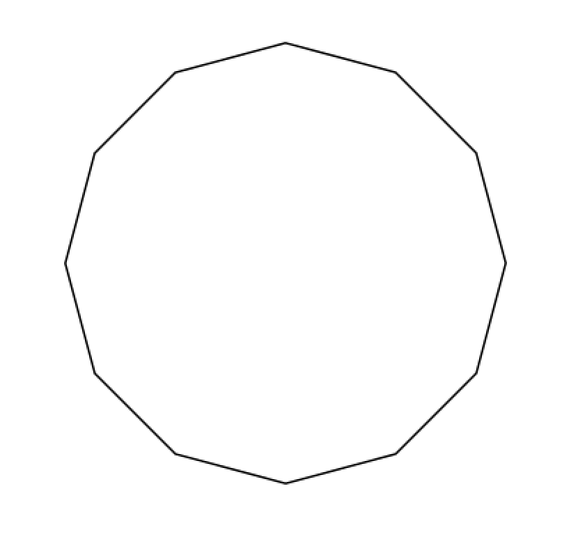
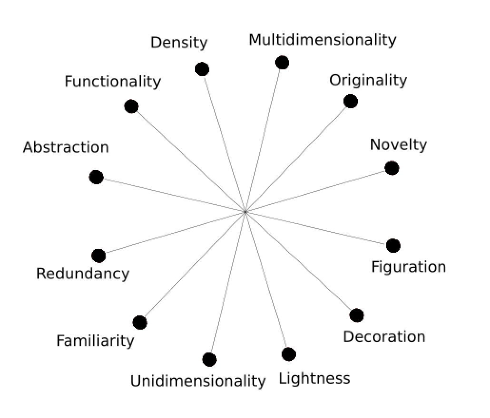
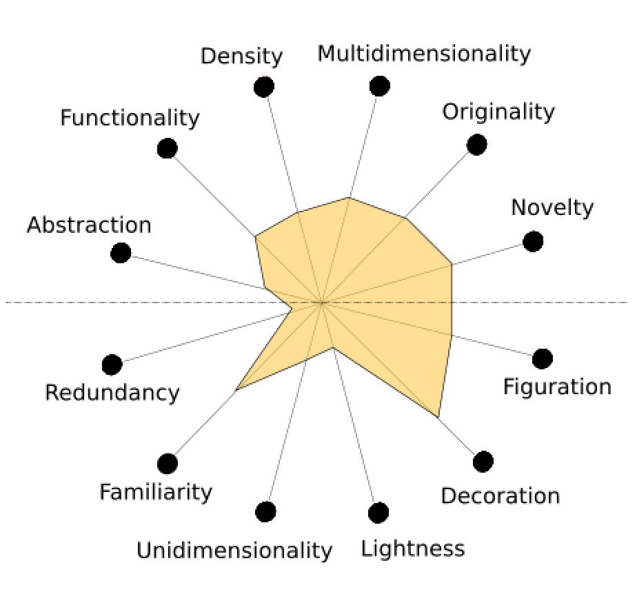

# INF 554 Assignment 3

## Table of Contents

  1. [Infographics](#infographics)
  2. [Cloning this repository](#cloning-this-repository)
  3. [Dynamic Alignment](#dynamic-alignment)
  4. [Debugging in Javascript](#debugging-in-javascript)
  5. [Styles using CSS and Inline](#styles-using-css-and-inline)
  6. [Style Inheritance](#style-inheritance)
  7. [Creating Visualization Wheels](#creating-visualization-wheels)
  8. [Using tables in HTML](#using-tables-in-html)

## Infographics

The two infographics used in [index.html](index.html) were obtained from [UNICEF USA](https://www.unicefusa.org/infographic-world-water-crisis) and from [Huffington Post](https://www.huffingtonpost.com/seth-m-siegel/infographic-the-5-main-dr_b_9073070.html). The first infographic was created in 2014 and the second in 2016.  

## Cloning this repository

Use the following commands to clone the dictionary and open the html page created for the assignment. The html page will open in your default browser.

```bash
git clone https://github.com/INF554Fall18/a3-akashsrihari.git
cd a3-akashsrihari
open ./index.html
```

## Dynamic Alignment

To create a tailored fit of the html page, the widths of objects in the webpage were dynamically generated using javascript commands stored in [chart.js](chart.js). The width of the webpage is calculated and then assigned to the body, after which each element is also given the same width. For the UNICEF infographic, 65% of the width is given and 35% for the Huffington Post infographic. Shown below is the snippet used to calculate page width.

```javascript
var pageWidth = window.innerWidth || document.body.clientWidth
var body = document.getElementById('main')
```

## Debugging in Javascript

Debugging can be done in the [chart.js](chart.js) file using console messages as shown below.

```javascript
console.log("Page width is "+pageWidth.toString())
console.log("Body width (and table and image widths) set as "+(pageWidth-200).toString())
```

## Styles using CSS and Inline

Different elements were given different styles generally and based on class name. For example, there are two style definitions for div elements, one for all div elements and one for div elements with class "text".

```css
div.text {
    display: block;
    text-align: left;
    justify-content: left;
}

div {
    display: flex;
    justify-content: center;
}
```

The same case was with th elements in the html page. However, in some places, the font-size for th elements was overridden using inline style statements. A new css style added in this repository that is worth mentioning is the drawing of horizontal lines after titles, which can be done using the lines shown below.

```css
h1:after
{
    content:' ';
    display:block;
    border:0.5px solid black;
}

h2:after
{
    content:' ';
    display:block;
    border:0.5px solid black;
}
```

This draws a line of thickness 0.5px after each h1 or h2 element, creating a neat and sleek look.

## Style Inheritance

By applying certain styles to the parent element, the children elements also get the same styles. To ensure that all the text in the html page is in a single font family and that every element has margin space, the font-family and margins style can be applied to the body of the page itself.

```css
body {
    margin-left: 100px;
    margin-right: 100px;
    font-family: Arial;
}
```

## Creating Visualization Wheels

To create the wheel, the following steps were used:

  1. Draw a 12 sided polygon
    <div style="display: flex;justify-content: center;">
        
    </div>
  2. Draw straight lines from each corner to its opposite corner, then delete the polygon (retaining the lines)
    <div style="display: flex;justify-content: center;">
        
    </div>
  3. Label the axes
    <div style="display: flex;justify-content: center;">
        
    </div>
  4. Connect all the points on each axis, creating a polygon that describes the infographic
    <div style="display: flex;justify-content: center;">
        
    </div>

## Using tables in HTML

Tables were used in the html page to align and compare infographics. The widths of the tables were dynamically generated so that all elements on the webpage look neat and aligned. The tables were created using the format of html code shown below.

```html
<table id="table1" cellpadding="10">
    <!-- Rows here -->
    <tr>
        <!-- Columns here -->
        <th>
            <!-- Text here -->
        </th>
    </tr>
</table>
```

Cell widths and heights are adjusted by the browser automatically, making the task easier. Cell padding can be introduced to make sure that the text in each cell looks neat and does not touch the borders.